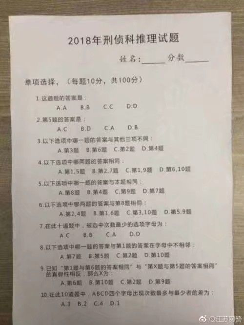

Wired Reasoning Problem [Java]

MCQ Question: Translated from Chinese:

1. The answer to the question is:
A.A    B.B   C.C   D.D

2. The answer to question #5 is:
A.C    B.D   C.A   D.B

3. Which question has a different answer compared with other three in the following options:
A. Question #3 B.Question #6 C.Question #2 D.Question #4

4. Which two questions have the exactly same answer:
A. Question #1, #5 B. Question #2, #7 C.Question #1, #9 D.Question #6, #10

5. Which question has same answer to this question:
A. Question #8 B. Question #4 C.Question #9 D. Question #7

6. Which two questions have a same answer with question #8:
A. Question #2, #4 B.Question #1, #6 C.Question #3, #10 C.Question #5, #9

7. Through all the answers of the 10 questions, which alphabet would be chosen for the least times:
A.C B.B C.A D.D

8. Which question has an answer that its alphabet does NOT abut to the answer alphabet of question #1:
A. Question #7 B.Question #5 C.Question #2 D.Question #10

9. Given that the two following statements:
 "The question #1 and question #6 has a same answer."
 "The question #X and question #5 has a same answer."
 and that the two statements is a contrary on truth (one true, another is false),
 what does the X stand for?
 A. Question #6 B. Question #10 C. Question #2 D. Question #10

 10. What is the difference between the most alphabetic occurrence and the least alphabetic occurrence within the answers of these 10 questions in terms of ABCD:  
 A.3 B.2 C.4 D.1

